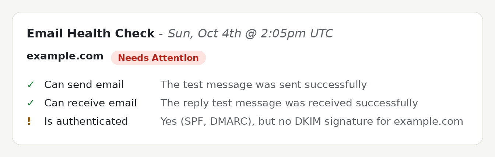

# Email Health Check

Send any email to a test address and, within a minute or so, get an email back that says whether your
domain's mail is set up properly: PTR (reverse DNS), SPF, DKIM and DMARC, plus an at-a-glance summary.
Optionally, the same report can also be looked up on a small web page by entering the address you sent
from.

It's meant for the people who look after a domain's email: send a test from the mail system you want to
check, and the report shows what a receiving server sees.

## Features

- **One email, one report:** can the domain send and receive mail, and is it authenticated, with an "All
  Tests Passed", "Needs Attention" or "Incomplete" verdict and a box per check that explains anything
  that doesn't pass.
- **Checks the whole record, not just this message:** SPF lookup limits, broken includes, invalid DMARC
  policies and DKIM signatures that only cover your mail service are all pointed out.
- **Shareable:** the report email includes the summary as a picture, plus the full message headers.
- **Optional web page** to look a report up by address, with built-in documentation at `/docs/`.
- **Private by design:** message bodies are never stored, test messages are deleted once they've been
  handled, and reports online expire within a day (minutes after they're first viewed).
- **Self-hosted:** one Docker image, configured entirely from a `.env` file.

## Requirements

- A mailbox used only for tests, reachable over IMAP with TLS (port 993) and a password login. The
  poller checks and deletes every message in it, so don't use a mailbox that gets other mail.
- A receiving mail server that writes Exim-style `Received:` headers (other formats need changes to
  `healthcheck/received.py`).
- An SMTP service to send the reports, with STARTTLS (usually port 587). Your sending domain's SPF and
  DKIM should include it, so the reports themselves are delivered.
- Docker with Compose, and, for the optional web page, a hostname and a reverse proxy for HTTPS.

## Quick start

    git clone https://github.com/gregdotca/email-health-check.git
    cd email-health-check
    cp .env.example .env    # then fill it in: see Configuration below
    docker compose run --rm --build poller python -m healthcheck.poller --check-smtp
    docker compose up -d --build

The `--check-smtp` line checks your settings and the SMTP login without sending anything. Then send any
email to the test address and the report should arrive within about 30 seconds (it checks the mailbox
every `POLL_SECONDS`, 30 in `.env.example`).

## Configuration

Everything is set in `.env`, and `.env.example` lists and explains every setting. Its first section is the
ones you must fill in, and everything below it is already set to the defaults:

| Setting | What it's for |
|---|---|
| `RECEIVING_EMAIL_ADDRESS` | The address people send tests to |
| `RECEIVING_EMAIL_HOST`, `RECEIVING_EMAIL_USER`, `RECEIVING_EMAIL_PASSWORD` | The test mailbox's IMAP login |
| `SENDING_EMAIL_HOST` (and usually `SENDING_EMAIL_HOST_USER`, `SENDING_EMAIL_HOST_PASSWORD`) | The SMTP service that sends the reports |
| `TRUSTED_MX_HOSTS` | Your receiving mail servers' names, as written after `by` in their `Received:` headers |
| `POLL_SECONDS` | Seconds between mailbox checks (at least 10) |

The web page runs when `PUBLIC_URL` and `COMPOSE_PROFILES='web'` are set (as in `.env.example`). The first
tells the app there's a web page, the second tells Docker Compose to start it. Point your reverse proxy at
`WEB_BIND`. Leave both empty to run email-only: no web page, and no reports kept.

## Documentation

With the web page running, the full documentation is at `/docs/` on your installation (for example
`https://check.example.com/docs/`), filled in with your own test address and limits. It covers sending
tests, reading every part of the report, each check and how to fix it, troubleshooting, privacy and
limits, and running your own copy (how it works, every setting, logs and updating). The pages' source is
in `services/web/project/templates/doc-pages/`.

## Common questions

- **No report came back?** Check the poller's log, `docker compose logs poller`: it says why each test
  was or wasn't answered (it never logs addresses). Tests from mailing lists, no-reply addresses or a
  different envelope domain aren't answered by email.
- **Does it keep my email?** No. Bodies are only read in memory to check DKIM, each test is deleted from
  the mailbox once it's been handled, and with the web page a report (headers and results) is kept for up
  to 24 hours if nobody views it, then 5 minutes after it's first viewed.
- **How do I update?** `git pull`, then `docker compose up -d --build`. Check the changelog and
  `.env.example` for new settings first.
- **Can I try it without sending or deleting anything?** Set `DRY_RUN=True`.

## Contributing

Issues and pull requests are welcome. The automated tests aren't part of this repository (they're built
around real email samples), so please describe how you tested a change.

The checks are in `services/web/healthcheck/` (`analyze.py`, `received.py`, `spfcheck.py`,
`dkimcheck.py`, `dmarccheck.py`, `dnsutil.py`), with the report wording in `report.py`, the email in
`mailer.py`, the summary picture in `summary_image.py`, storage in `store.py`, the mailbox poller in
`poller.py` and the settings in `settings.py`. The web page and documentation are in
`services/web/project/`. SPF uses [pyspf](https://pypi.org/project/pyspf/), DKIM
[dkimpy](https://pypi.org/project/dkimpy/), and the summary picture is drawn with Pillow.

## Security

Please report vulnerabilities privately: see [SECURITY.md](SECURITY.md).

## License

MIT: see [LICENSE](LICENSE). The bundled DejaVu fonts keep their own license
(`services/web/healthcheck/fonts/LICENSE-DejaVu.txt`).
